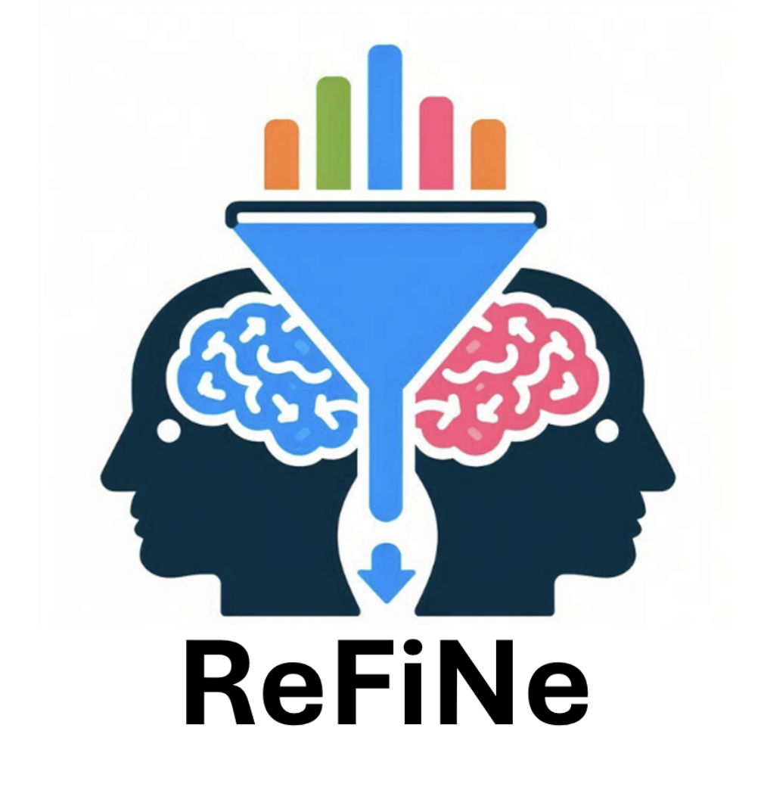

# Abstract


<p align="center">
  
<figcaption>Figure | Investigating the Replicability of Findings in Neuroimaging </figcaption>
</p>


<!--<hr>
# Citation

If you find this work useful, please consider citing our paper:

```bibtex
@article {DibbleNeuroFM2026,
	author = {Dibble, Austin and Dalby, Connor and Sevegnani, Michele and Fracasso, Alessio and Lyall, Donald M and Harvey, Monika and Svanera, Michele},
	title = {NeuroFM: Toward Precision Neuroimaging with Foundation Models for Individualized Brain Health Estimation},
	elocation-id = {2026.03.27.26349489},
	year = {2026},
	doi = {10.64898/2026.03.27.26349489},
	publisher = {Cold Spring Harbor Laboratory Press},
	abstract = {Precision neuroimaging aims to deliver individualized assessments of brain health, yet a single structural MRI does not yield a multidimensional, quantitative summary of an individual{\textquoteright}s current health or future risk. Existing approaches optimize task-specific objectives, yielding representations entangled with cohort- or disease-specific signals rather than capturing biologically grounded patterns of anatomical variation. Here, we introduce NeuroFM, a foundation model trained exclusively on 100,000 healthy synthetic volumes to predict morphometric and demographic targets. Without exposure to diagnostic labels, NeuroFM organizes brain MRIs into population-level patterns that encode meaningful brain health differences. These representations transfer across five neuroscience domains without adaptation and support simple linear readouts for clinical, cognitive, developmental, socio-behavioural, and image quality control. Evaluated on 136,361 real volumes spanning multiple cohorts, NeuroFM generalizes across domains and enables individual-level brain health profiling, estimating future dementia risk years before diagnosis. Together, these findings establish a disease-naive foundation model paradigm for precision neuroimaging. Code available at: https://rocknroll87q.github.io/NeuroFM/},
	URL = {https://www.medrxiv.org/content/early/2026/03/31/2026.03.27.26349489},
	eprint = {https://www.medrxiv.org/content/early/2026/03/31/2026.03.27.26349489.full.pdf},
	journal = {medRxiv}
}
```
-->

<hr>
<!--
# Acknowledgments
xxx

<hr>
-->
# Slides

Call for ReFiNe replication project - [link](https://docs.google.com/presentation/d/1Cnp0aUq7NzE-Q5TsfxHGOZatzmeiUWtZP1Ee-_VhzuU/edit?usp=sharing)

<hr>

# Open Call
Call for ReFiNe replication project - form to contribute: [link](https://forms.gle/gM9EymHnxZRJBWRC6)


