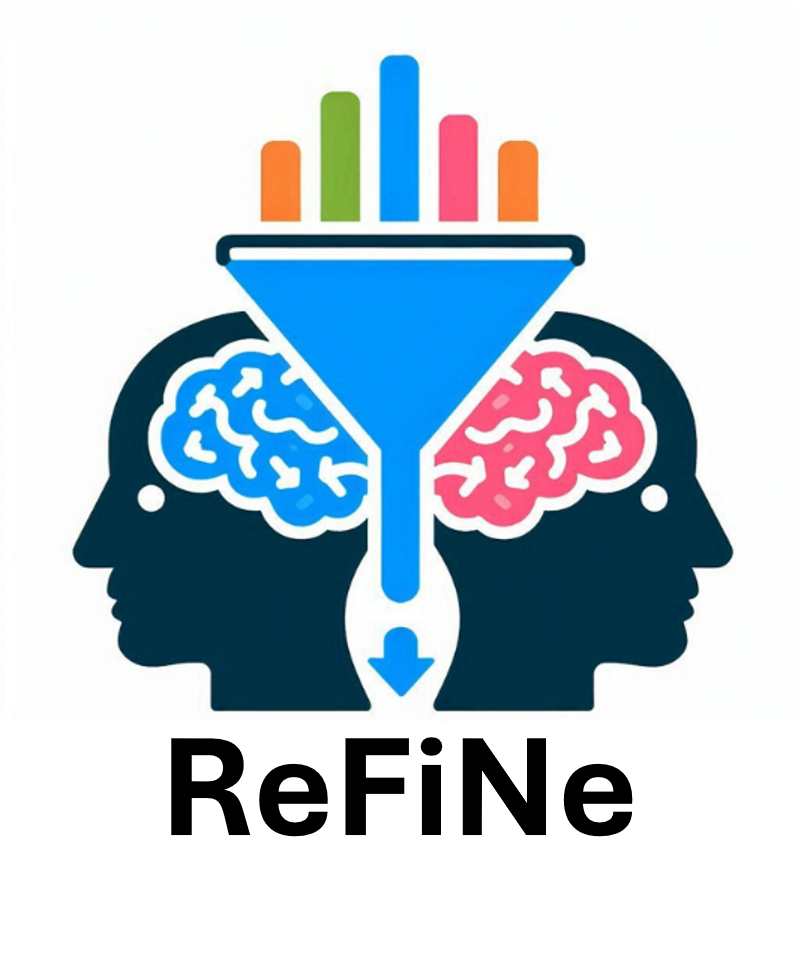

# About the replication project

ReFiNe (Replicability of Findings in Neuroimaging) is an open community initiative aimed at systematically evaluating the replicability of neuroimaging findings. The project is based on a series of direct replication studies that reproduce original analyses as closely as possible in independent datasets to determine which findings replicate, which do not, and which factors predict replication success.

<p align="center">
  
<!--<figcaption>Figure | Investigating the Replicability of Findings in Neuroimaging </figcaption>-->
</p>

The current focus of ReFiNe is structural MRI research in major depressive disorder, where ongoing pilot work has established the feasibility of the approach. Over time, the initiative aims to expand across psychiatric disorders, research topics, and neuroimaging modalities.

The ReFiNe website serves as a central hub for coordinating and standardizing replication research. It will provide resources such as curated lists of potential replication targets, replication protocols, preregistration templates, study matching guidance, standardized data extraction forms, replication reporting templates, and information on ongoing and completed replication projects.

Researchers interested in conducting replications, contributing datasets, developing methods, or supporting the initiative are invited to join the growing ReFiNe community.


## Planned Resources

**Replication Protocols**

* Standardized protocols for conducting direct and conceptual neuroimaging replication studies
* Preregistration templates and reporting guidelines
* Practical guidance for study selection, dataset matching, and replication workflows

**Replication Targets**

* Curated database of published neuroimaging findings suitable for replication
* Information on study characteristics and replication requirements (e.g., population, predictors, imaging modality, analysis approach)
* Registration and tracking of planned, ongoing, and completed replication attempts

**Replication Surveys**

* Standardized pre-analysis surveys assessing expected replication success
* Standardized post-analysis surveys documenting replication outcomes
* Collection of data to investigate predictors of replicability and calibration of researcher expectations

**Community Hub**

* Information on how to contribute to the project
* Updates on ongoing projects and collaborative opportunities
* Open resources supporting coordinated, transparent, and cumulative replication research


<!--<hr>
# Citation

If you find this work useful, please consider citing our paper:

```bibtex
@article {DibbleNeuroFM2026,
	author = {Dibble, Austin and Dalby, Connor and Sevegnani, Michele and Fracasso, Alessio and Lyall, Donald M and Harvey, Monika and Svanera, Michele},
	title = {NeuroFM: Toward Precision Neuroimaging with Foundation Models for Individualized Brain Health Estimation},
	elocation-id = {2026.03.27.26349489},
	year = {2026},
	doi = {10.64898/2026.03.27.26349489},
	publisher = {Cold Spring Harbor Laboratory Press},
	abstract = {Precision neuroimaging aims to deliver individualized assessments of brain health, yet a single structural MRI does not yield a multidimensional, quantitative summary of an individual{\textquoteright}s current health or future risk. Existing approaches optimize task-specific objectives, yielding representations entangled with cohort- or disease-specific signals rather than capturing biologically grounded patterns of anatomical variation. Here, we introduce NeuroFM, a foundation model trained exclusively on 100,000 healthy synthetic volumes to predict morphometric and demographic targets. Without exposure to diagnostic labels, NeuroFM organizes brain MRIs into population-level patterns that encode meaningful brain health differences. These representations transfer across five neuroscience domains without adaptation and support simple linear readouts for clinical, cognitive, developmental, socio-behavioural, and image quality control. Evaluated on 136,361 real volumes spanning multiple cohorts, NeuroFM generalizes across domains and enables individual-level brain health profiling, estimating future dementia risk years before diagnosis. Together, these findings establish a disease-naive foundation model paradigm for precision neuroimaging. Code available at: https://rocknroll87q.github.io/NeuroFM/},
	URL = {https://www.medrxiv.org/content/early/2026/03/31/2026.03.27.26349489},
	eprint = {https://www.medrxiv.org/content/early/2026/03/31/2026.03.27.26349489.full.pdf},
	journal = {medRxiv}
}
```
-->
<hr>
# BrainHack contributers


<div style="text-align:center; font-size:18px; display:flex; justify-content:center; gap:28px; flex-wrap:wrap; margin:0 0 0.5rem 0;">

  <span>
    <a href="https://www.linkedin.com/in/janik-goltermann-4089ba303/" target="_blank">Janik Goltermann</a>
    <sup>✦</sup>
  </span>

  <span>
    <a href="https://www.linkedin.com/in/michele-svanera/" target="_blank">Michele Svanera</a>
    <sup>♫</sup>
  </span>

  <span>
    <a href="https://www.linkedin.com/in/katie-robertson-6704a61a3/" target="_blank">Katie Robertson</a>
    <sup>♫</sup>
  </span>

</div>

<div style="text-align:center; font-size:15px; line-height:1.5; margin-top:0;">

  <div><sup>✦</sup> Charité – Universitätsmedizin Berlin</div>

  <div><sup>♫</sup> Center for Cognitive Neuroimaging, University of Glasgow, UK</div>

</div>
  
<hr>
<!--
# Acknowledgments
xxx

<hr>
-->
<!--# Slides

Call for ReFiNe replication project - [link](https://docs.google.com/presentation/d/1Cnp0aUq7NzE-Q5TsfxHGOZatzmeiUWtZP1Ee-_VhzuU/edit?usp=sharing)

<hr>-->


# Open Call
Call for ReFiNe replication project - form to contribute: [link](https://forms.gle/gM9EymHnxZRJBWRC6)


