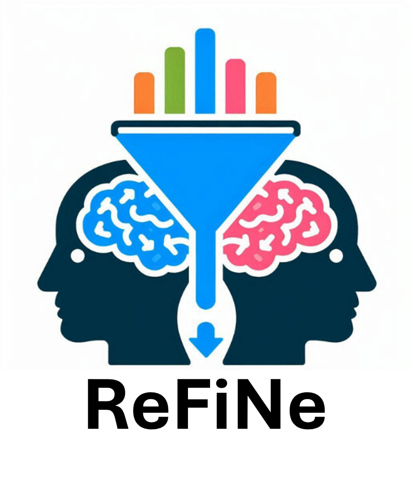
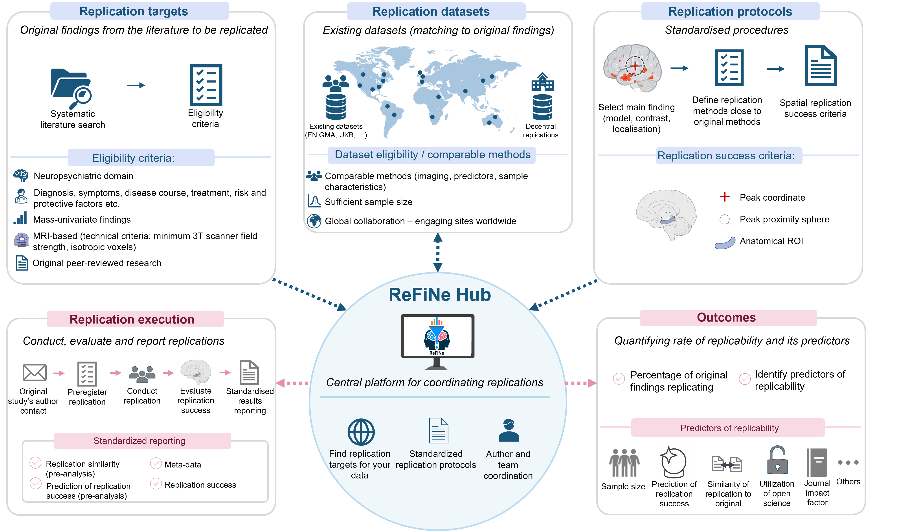

# About ReFiNe




**ReFiNe** (*Replicability of Findings in Neuroimaging*) is a systematic community-driven initiative aimed at evaluating the replicability of neuropsychiatric MRI findings through direct replication studies. Direct replications reproduce the methods and analyses of original studies as closely as possible in independent replication datasets. ReFiNe combines a standardized replication framework with an open collaborative infrastructure that enables researchers worldwide to contribute direct replication studies using their own independent datasets.

The central objectives are:

1. Estimating the rate of replicability for the field
2. Identifying study characteristics that are predictive of replication success

The overall goal is to investigate the reliability of the current literature and to derive evidence-based methodological recommendations for designing MRI studies that produce replicable findings.

The ReFiNe-Hub website serves as a central hub for coordinating and standardizing this replication project. Its purpose is to facilitate the identification of eligible replication targets and their matching to suitable existing datasets. Furthermore, it provides resources including guidance on selecting replication targets (original findings to replicate), replication protocols, preregistration templates, and standardized results reporting forms.

The ReFiNe-Hub also provides information on the underlying replication framework, related publications, and guidance for contributors, including the publication strategy and authorship policy.


<hr>
# Project overview



<!--<hr>
# Citation

If you find this work useful, please consider citing our paper:

```bibtex
@article {DibbleNeuroFM2026,
	author = {Dibble, Austin and Dalby, Connor and Sevegnani, Michele and Fracasso, Alessio and Lyall, Donald M and Harvey, Monika and Svanera, Michele},
	title = {NeuroFM: Toward Precision Neuroimaging with Foundation Models for Individualized Brain Health Estimation},
	elocation-id = {2026.03.27.26349489},
	year = {2026},
	doi = {10.64898/2026.03.27.26349489},
	publisher = {Cold Spring Harbor Laboratory Press},
	abstract = {Precision neuroimaging aims to deliver individualized assessments of brain health, yet a single structural MRI does not yield a multidimensional, quantitative summary of an individual{\textquoteright}s current health or future risk. Existing approaches optimize task-specific objectives, yielding representations entangled with cohort- or disease-specific signals rather than capturing biologically grounded patterns of anatomical variation. Here, we introduce NeuroFM, a foundation model trained exclusively on 100,000 healthy synthetic volumes to predict morphometric and demographic targets. Without exposure to diagnostic labels, NeuroFM organizes brain MRIs into population-level patterns that encode meaningful brain health differences. These representations transfer across five neuroscience domains without adaptation and support simple linear readouts for clinical, cognitive, developmental, socio-behavioural, and image quality control. Evaluated on 136,361 real volumes spanning multiple cohorts, NeuroFM generalizes across domains and enables individual-level brain health profiling, estimating future dementia risk years before diagnosis. Together, these findings establish a disease-naive foundation model paradigm for precision neuroimaging. Code available at: https://rocknroll87q.github.io/NeuroFM/},
	URL = {https://www.medrxiv.org/content/early/2026/03/31/2026.03.27.26349489},
	eprint = {https://www.medrxiv.org/content/early/2026/03/31/2026.03.27.26349489.full.pdf},
	journal = {medRxiv}
}
```
-->
<hr>

# OHBM 2026 BrainHack contributors

The ReFiNe concept was presented and discussed during the OHBM 2026 BrainHack in Bordeaux, where feedback from the broader BrainHack community helped refine the project and its planned infrastructure. In addition to this valuable community input, the following contributors played central roles in developing the ReFiNe-Hub as a means of coordinating and harmonizing replications:

<div style="text-align:center; font-size:18px; display:flex; justify-content:center; gap:28px; flex-wrap:wrap; margin:0 0 0.5rem 0;">

  <span>
    <a href="https://www.linkedin.com/in/janik-goltermann-4089ba303/" target="_blank">Janik Goltermann</a>
    <sup>✦</sup>
  </span>

  <span>
    <a href="https://www.linkedin.com/in/michele-svanera/" target="_blank">Michele Svanera</a>
    <sup>♫</sup>
  </span>

  <span>
    <a href="https://www.linkedin.com/in/katie-robertson-6704a61a3/" target="_blank">Katie Robertson</a>
    <sup>♫</sup>
  </span>

</div>

<div style="text-align:center; font-size:15px; line-height:1.5; margin-top:0;">

  <div><sup>✦</sup> Charité – Universitätsmedizin Berlin</div>

  <div><sup>♫</sup> Center for Cognitive Neuroimaging, University of Glasgow, UK</div>

</div>
  
<hr>
<!--
# Acknowledgments
xxx

<hr>
-->
<!--# Slides

Call for ReFiNe replication project - [link](https://docs.google.com/presentation/d/1Cnp0aUq7NzE-Q5TsfxHGOZatzmeiUWtZP1Ee-_VhzuU/edit?usp=sharing)

<hr>-->
